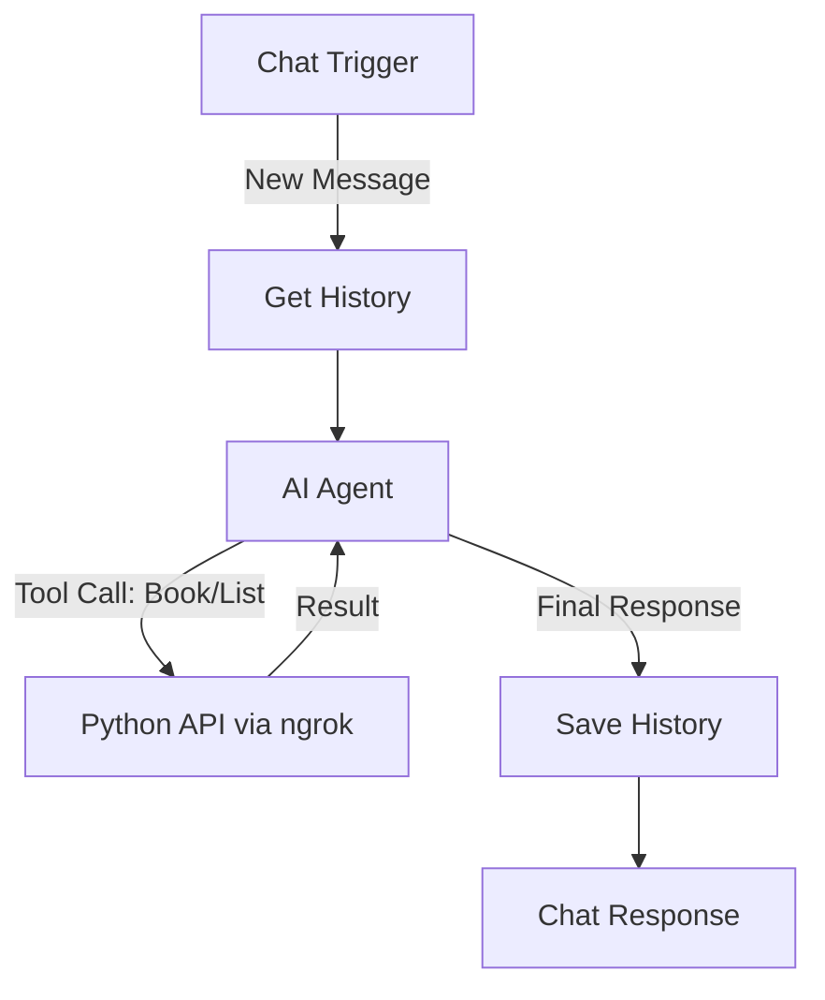

# n8n Integration Guide (Remote n8n via ngrok)

This guide details how to build the workflow in n8n to connect your Chat Interface with the Python Booking Agent running locally, exposed via ngrok.

## Getting Your ngrok URL

**FIRST STEP:** Get your public ngrok URL by opening `http://127.0.0.1:4040` in your browser.

You'll see something like:
```
Forwarding: https://abc123-def456.ngrok-free.app -> http://localhost:8000
```

Copy that `https://` URL - you'll use it in ALL the steps below. I'll refer to it as `YOUR_NGROK_URL`.

## Workflow Overview



## Step-by-Step Configuration

### 1. Trigger: On Chat Message
- **Node Type**: `Chat Trigger`
- **Output**: `text` (The user's message)

### 2. Node: Get Context (HTTP Request)
Fetch previous conversation history to make the agent "smart".
- **Method**: `GET`
- **URL**: `YOUR_NGROK_URL/history/list`
  - Example: `https://abc123.ngrok-free.app/history/list`
- **Query Parameters**:
    - `user_id`: `owner` (static string for persistent history)
    - `limit`: `10`
- **Output**: Returns an array of previous messages.

> [!TIP]
> **Why static `user_id`?** Using `owner` gives your agent permanent memory across all sessions, regardless of where you access it from.

### 3. Node: AI Agent
This is the brain. Use an **OpenAI Chat Model** or similar.
- **System Prompt**:
    > You are a helpful booking assistant. Use the available tools to check the calendar or book appointments. Always be polite and professional.
- **Context**: Pass the history from step 2 into the AI's context window.

#### Tools Configuration (Crucial)
Add **HTTP Request** tools to the AI Agent:

**Tool A: check_availability**
- **Name**: `check_availability`
- **Description**: "List upcoming events from the user's calendar."
- **Method**: `GET`
- **URL**: `YOUR_NGROK_URL/calendar/events`
  - Example: `https://abc123.ngrok-free.app/calendar/events`
- **Query Params**: 
    - `limit`: Number of events to fetch (optional, default 10)

**Tool B: book_appointment**
- **Name**: `book_appointment`
- **Description**: "Book a new appointment on the user's calendar with attendees and automatic Google Meet link."
- **Method**: `POST`
- **URL**: `YOUR_NGROK_URL/calendar/book`
  - Example: `https://abc123.ngrok-free.app/calendar/book`
- **Body Type**: JSON
- **Body Parameters**:
    ```json
    {
      "summary": "Meeting with client",
      "start_time": "2026-01-22T10:00:00Z",
      "end_time": "2026-01-22T11:00:00Z",
      "description": "Discuss project requirements",
      "attendee_emails": ["client@example.com", "colleague@example.com"]
    }
    ```
    *Note: The AI must generate these fields in ISO 8601 format (YYYY-MM-DDTHH:MM:SSZ). The `attendee_emails` field is optional but required to book on recipient's calendar. A Google Meet link is automatically created for all events.*

**Tool C: reschedule_appointment**
- **Name**: `reschedule_appointment`
- **Description**: "Reschedule an existing appointment to a new time."
- **Method**: `POST`
- **URL**: `YOUR_NGROK_URL/calendar/reschedule?event_id=EVENT_ID`
  - Example: `https://abc123.ngrok-free.app/calendar/reschedule?event_id=abc123xyz`
- **Body Type**: JSON
- **Body Parameters**:
    ```json
    {
      "summary": "Updated meeting title",
      "start_time": "2026-01-23T14:00:00Z",
      "end_time": "2026-01-23T15:00:00Z",
      "description": "Updated description"
    }
    ```
    *Note: Only the fields you want to update need to be provided. The event_id goes in the query parameter.*

**Tool D: cancel_appointment** (Optional)
- **Name**: `cancel_appointment`
- **Description**: "Cancel an existing appointment."
- **Method**: `POST`
- **URL**: `YOUR_NGROK_URL/calendar/cancel`
- **Body**:
    ```json
    {
      "event_id": "event_123"
    }
    ```

### 4. Node: Save User Message (HTTP Request)
Place this BEFORE the AI Agent node.
- **Method**: `POST`
- **URL**: `YOUR_NGROK_URL/history/add`
- **Body Type**: JSON
- **Important**: Use the expression editor to properly handle multi-line messages
- **Body**:
    ```json
    {
      "user_id": "owner",
      "role": "user",
      "content": {{ JSON.stringify($json.chatInput) }}
    }
    ```
    > [!WARNING]
    > **Multi-line message fix:** If you use `"{{ $json.chatInput }}"` with quotes, n8n will insert literal line breaks into the JSON string when messages contain newlines, making it invalid JSON. Instead, use `{{ JSON.stringify($json.chatInput) }}` without outer quotes to properly escape the content.

### 5. Node: Save Agent Response (HTTP Request)
Place this AFTER the AI Agent node.
- **Method**: `POST`
- **URL**: `YOUR_NGROK_URL/history/add`
- **Body Type**: JSON
- **Body**:
    ```json
    {
      "user_id": "owner",
      "role": "assistant",
      "content": {{ JSON.stringify($json.output) }}
    }
    ```

## Complete Workflow Order

1. **Chat Trigger** - Receives user message
2. **Save User Message** - Stores it in history
3. **Get Context** - Fetches recent conversation
4. **AI Agent** - Processes message with tools
5. **Save Agent Response** - Stores AI reply
6. **Chat Response** - Sends reply to user

## Important Notes

> [!WARNING]
> **ngrok URLs change!** Every time you restart ngrok, you get a new URL. You'll need to update all your n8n nodes with the new URL each time. (Paid ngrok accounts get static domains.)

> [!IMPORTANT]
> **Keep ngrok running:** The tunnel must be active for n8n to reach your local API. Don't close the ngrok terminal window.

## Testing Your Setup

1. In n8n, trigger the workflow manually with a test message like "What's on my calendar?"
2. Check the execution log - you should see:
   - History retrieval working
   - AI calling `check_availability`
   - Response being saved
3. Check `http://127.0.0.1:4040/inspect/http` to see the actual HTTP requests n8n is making

## Troubleshooting

- **403/401 errors**: Check if ngrok requires browser verification (free tier). Add `--verify-webhook-secret` if needed.
- **Timeouts**: n8n default timeout is 5 minutes, should be fine for most requests.
- **Calendar auth fails**: The first time, Google will pop up an auth window on YOUR local machine (where the API runs).
